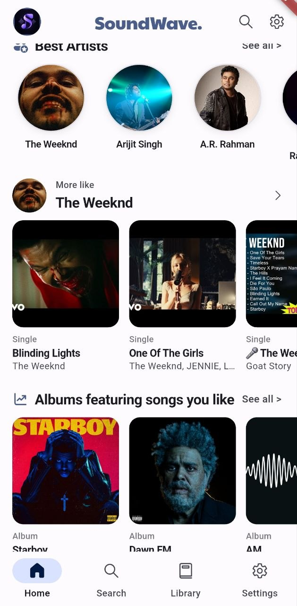
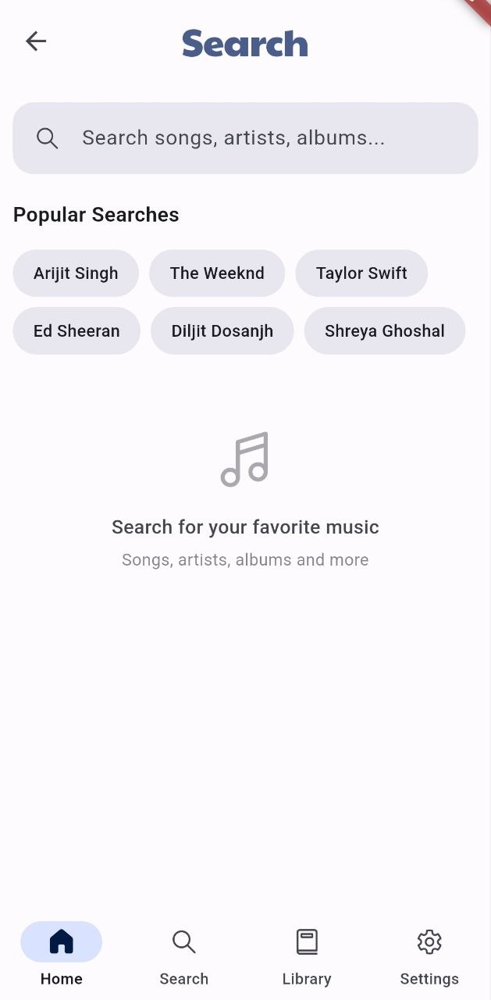
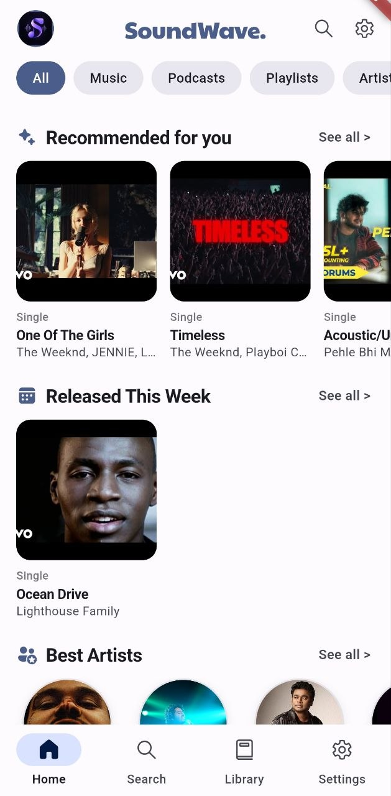

<div align="center">


# SoundWave

**A modern, open-source music player built with Flutter.**

Search, discover, organize, and enjoy your music in one simple experience.

[](https://github.com/tejasshinde4545k/SoundWave/stargazers)
[](https://github.com/tejasshinde4545k/SoundWave/forks)
[](https://github.com/tejasshinde4545k/SoundWave/releases)
[](LICENSE)

</div>

---

## About SoundWave

SoundWave is an open-source music player focused on providing a clean, modern, and customizable listening experience.

The project is built with Flutter and is designed to make discovering and managing music simple while still providing useful features for people who want more control over their listening experience.

This repository contains my development and customization of SoundWave, including UI improvements, feature work, and ongoing experimentation.

---

## Features

* Online song search with suggestions
* Offline listening support
* Recently played music
* Personalized recommendations
* Custom playlists
* Playlist import and export
* Spotify playlist import
* Listening recaps
* Radio stations
* Lyrics support
* SponsorBlock support
* Built-in equalizer and presets
* Optimized audio experience
* No advertisements
* No subscription requirement
* Built-in updater
* Material Design interface
* Accent color customization
* Dynamic colors on Android 12+
* Multiple language support
* Import and export of user data

> Features may change as the project continues to evolve.

---

## Screenshots

<div align="center">

| Dashboard | Music Player | Search |
| :---: | :---: | :---: |
|  |  |  |

</div>

---

## Download

You can download the latest available build from the GitHub Releases page.

<div align="center">

<a href="https://github.com/tejasshinde4545k/SoundWave/releases/latest">

</a>

</div>

> Additional distribution platforms will be listed here when an official SoundWave build becomes available.

---

## Getting Started

### Requirements

Before building SoundWave, make sure you have:

* Flutter SDK
* Dart SDK
* Android Studio or another supported Android development environment
* An Android device or emulator

Check your Flutter installation with:

```bash
flutter doctor
```

### Clone the repository

```bash
git clone https://github.com/tejasshinde4545k/SoundWave.git
cd SoundWave
```

### Install dependencies

```bash
flutter pub get
```

### Run the application

```bash
flutter run
```

---

## Contributing

Contributions, ideas, bug reports, and improvements are welcome.

You don't need to make a huge change to contribute. Fixing a bug, improving the interface, updating documentation, or suggesting a useful feature can all make a difference.

Before contributing, please read:

**[CONTRIBUTING.md](CONTRIBUTING.md)**

Please also read our:

**[CODE_OF_CONDUCT.md](CODE_OF_CONDUCT.md)**

---

## Bug Reports & Feature Requests

Found a problem or have an idea?

Before opening a new issue, please check whether a similar issue already exists.

When reporting a bug, include:

* What happened
* What you expected
* Steps to reproduce it
* Device and Android version
* Relevant logs or error messages
* Screenshots or screen recordings when useful

For feature requests, explain what you'd like to see and why you think it would improve SoundWave.

---

## Community

SoundWave is an evolving project, and feedback is always welcome.

If you have suggestions, UI ideas, feature requests, or general thoughts about the project, feel free to open an issue or start a discussion.

Constructive feedback helps shape the future of SoundWave.


## Credits & Inspiration

SoundWave was originally inspired by **Musify**.

The project has since been reimplemented and developed with its own direction, design, features, and branding.

Original inspiration:

https://github.com/Harsh-23/Musify

Additional attribution and licensing information can be found in the project source and license files.

---

## License

SoundWave is released under the **GNU General Public License v3.0 (GPL-3.0)** where applicable.

Please see the [LICENSE](LICENSE) file for the complete license terms.

If you distribute modified versions of GPL-licensed portions of the project, you must comply with the applicable GPL requirements, including the requirements concerning source code and license notices.

---

## Disclaimer

SoundWave does not host, own, or distribute copyrighted audio content.

The application may interact with external services, plugins, or content providers to provide music-related functionality. The availability and legality of content may vary depending on the service, location, and applicable laws.

All trademarks, music, audio files, artwork, and other copyrighted material remain the property of their respective owners.

Users are responsible for ensuring that their use of SoundWave and any connected services complies with applicable laws and the terms of service of those services.

The developers and contributors do not encourage copyright infringement and are not responsible for how the software or third-party services are used.

---

## Project Status

SoundWave is actively being developed.

New features, UI improvements, performance improvements, and bug fixes may be introduced over time.

If you like the project, consider giving it a ⭐ on GitHub. It helps the project get noticed and encourages further development.

<div align="center">

**Built with Flutter ❤️**

</div>
